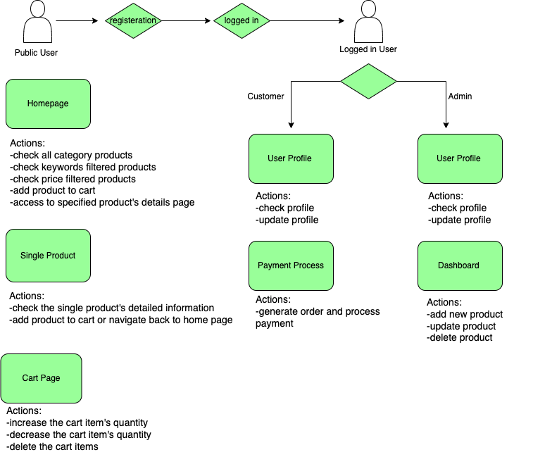

## E-commerce Website Documentation
## Introduction

This documentation provides information on how to use and understand the features of the E-commerce website using the https://fakeapi.platzi.com/ API endpoint. The website is designed to showcase products, allow users to browse, add items to their cart, and perform various actions such as registration, login, and profile management.

## Table of Contents
    1. Getting Started
    2. Dev Technics
    3. document Structure 
    4. Pages
    5. Redux Store
    6. Private Routes
    7. Unit Testing
    8. Deployment

1.  Getting Started
   Before using the E-commerce website, ensure that you have the following:
   1.1 -Node.js installed on your machine.    
   1.2 Installation
    To set up the project on your local machine, follow these steps:
    Clone the repository from GitHub: git clone [https://github.com/VeraCodes2023/fs16_6-frontend-project.git]
    Navigate to the project directory: 
        -npx create-react-app e-commerce --template redux-typescript
    Install dependencies: npm install:
        -@types/react-dom
        -@types/react
        - axios
        - react-router-dom 
        - reduxtoolkit 
        - material UI
    Start the development server: npm start
    The website should now be accessible at http://localhost:3000 in your web browser.

2.  Dev Technics
    -TypeScript
    -React.js 
    -Redux Toolkit 
    -React-router-dom 
    -SASS Styling
    -Material-UI 

3.  Document Structure
.
├── README.md
├── package.json
├── tsconfig.json
├── .gitignore
└── public
    └── favicon.ico
    └── index.html
    └── logo192.png
    └── logo152.png
    └── manifest.json
    └── robots.txt
└── src 
    └── setupTest.ts
    └── reportWebVitals.ts
    └── react-app-env.d.ts
    └── index.tsx
    └── App.tsx
    └── test
        └── App.test.tsx
        └── appRender.tsx
    └── components
        └──pages
            └──AdminDashBoard.tsx
            └──CartPage.tsx
            └──CreateProduct.tsx
            └──ErrorPage.tsx
            └──HeaderLogin.tsx
            └──HeaderLogout.tsx
            └──HomePage.tsx
            └──PaymentPage.tsx
            └──ProductGrid.tsx
            └──ProfileUpdate.tsx
            └──RegisterUser.tsx
            └──Search.tsx
            └──SingleProduct.tsx
            └──UserLogin.tsx
            └──UserProfile.tsx
        └──redux
            └──AsyncThunk
                └──productsAsync.ts
                └──userAsync.ts
            └──hooks
                └──useAppDispatch.ts
                └──useAppSelector.ts
                └──useDebounce.ts
            └──reducers
                └──authSlice.ts
                └──cartSlice.ts
                └──productSlice.ts
                └──userSlice.ts
            └──store.ts
        └──routes
            └──adminRoutes.ts
            └──privateRoutes.ts
            └──publicRoutes.ts
        └──shared
            └──ThemeContext.tsx
        └──styles
            └──admin.scss
            └──cart.scss
            └──clear.scss
            └──createProduct.scss
            └──createUser.scss
            └──details.scss
            └──footer.scss
            └──header.scss
            └──homepage.scss
            └──loginForm.scss
            └──main.scss
            └──profile.scss
            └──style.scss
            └──style.css 
        └──types
            └──CartItems.ts
            └──CreateProduct.ts
            └──PaginationQuery.ts
            └──Product.ts
            └──ProductInput.ts
            └──UpdateProfile.ts
            └──User.ts
            └──UserAuth.ts
            └──UserInput.ts
            └──UserList.ts       
  

4.  Pages
Overview
The E-commerce website consists of several pages, each serving a specific purpose. Here are the main pages:
a. All Products Page(Homepage) :
    .URL: /
    .Description: Displays all available products from the API.
    .Features:
        -Browse products.
        -Filter products by categories.
        -Sort products by price.
b. Single Product Page:
    .URL: /products/:id.
    .Description: Displays detailed information about a single product.
    .Features:View product details.

c. User's Profile Page:
    .URL: /profile.
    .Description: User profile page (only available if the user is logged in).
    .Features:View and update user profile information.
d. Cart Page:
    .URL: /cart
    .Description: Shopping cart page.
    .Features:
        -Add products to the cart.
        -Remove products from the cart.
        -Update the quantity of products in the cart.

5.  Redux Store
The application uses Redux for state management and has three main reducers:

a. Product Reducer
    Features:
        Get all products.
        Find a single product.
        Filter products by categories.
        Sort products by price.
        Create, update, and delete a product (only accessible to admin users).

b. User Reducer
    Features:
        Register as a new user.
        Log in as an existing user.

c. Cart Reducer
    Features:
        Add products to the cart.
        Remove products from the cart.
        Update the quantity of products in the cart.

6.  Private Routes

Certain routes within the application are protected and require user authentication. For example:The route to the user profile page (/profile) and admin dashboard (/admin) is only accessible if the user is logged in.

Authentication and authorization are implemented using Redux and are enforced on the client side.

7.  Unit Testing
Unit tests have been implemented for the reducers to ensure their functionality. You can run these tests using the following command:npm test

8.  Deployment link: https://timely-youtiao-ea3f66.netlify.app

